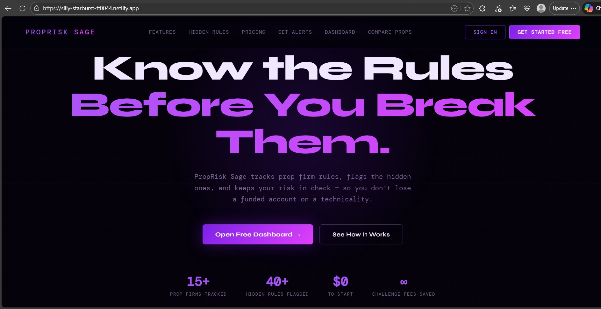

# PropRisk Sage

> Know the rules before you break them.

A free web tool for prop firm traders to compare firms, track risk, and avoid the hidden rules that kill funded accounts.

🔗 **Live site:** https://bnm-sun.github.io/Prop/

## Features
- Side-by-side comparison of 7+ prop firms (Apex, Topstep, FTMO, MFF, TradeDay & more)
- Hidden rules database — consistency caps, news bans, scaling plans
- Payout Junction verification badges
- Risk calculator — daily loss limit, position sizing, drawdown tracker
- Trade journal with equity curve and analytics
- No login required — data saves in browser

## Built with
HTML · CSS · Vanilla JavaScript · Chart.js · Supabase

## Screenshots

